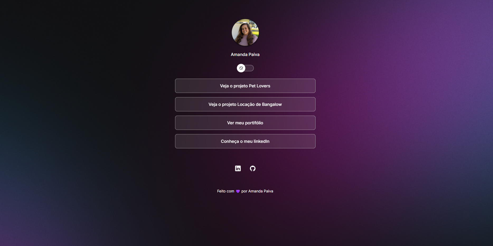
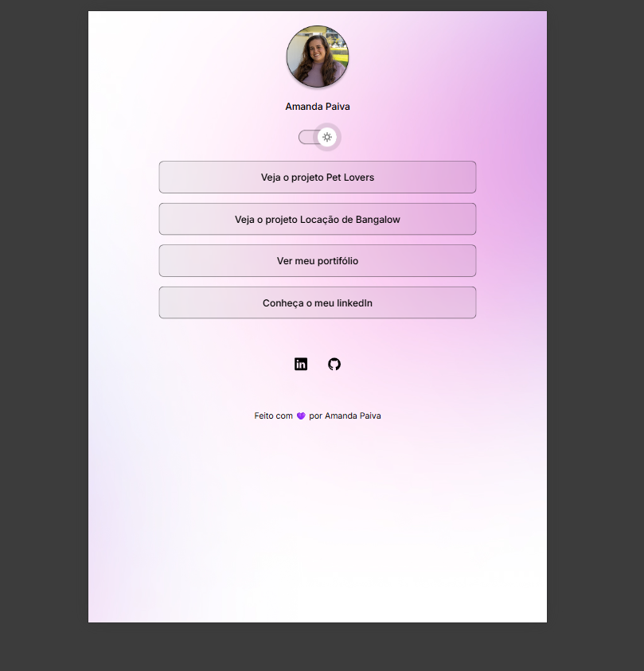
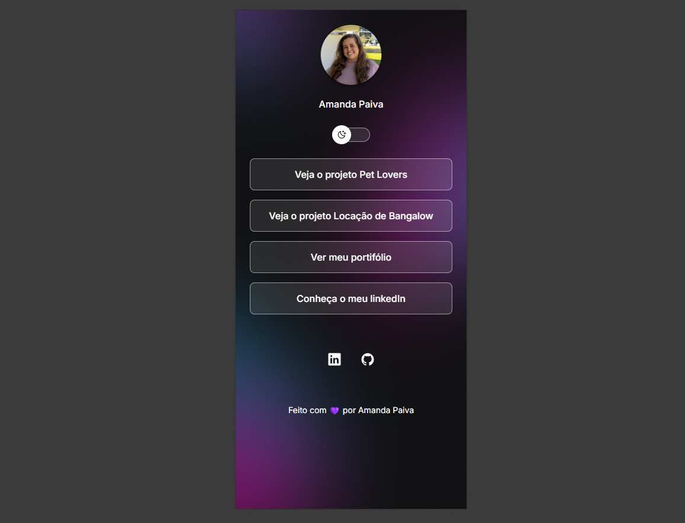

<h1 align="center"> DevLinks </h1>

Desenvolvi o DevLinks, um cartão de visitas digital criado durante o programa exclusivo e gratuito da Rocketseat para ensino de tecnologias web.

  <a href="#-tecnologias">Tecnologias</a>&nbsp;&nbsp;&nbsp;|&nbsp;&nbsp;&nbsp;
  <a href="#-projeto">Projeto</a>&nbsp;&nbsp;&nbsp;|&nbsp;&nbsp;&nbsp;
  <a href="#-layout">Layout</a>&nbsp;&nbsp;&nbsp;|&nbsp;&nbsp;&nbsp;
  <a href="#memo-licença">Licença</a>

  

 

  

  

  

## 🚀 Tecnologias

Esse projeto foi desenvolvido com as seguintes tecnologias:

- HTML e CSS
- JavaScript
- Git e Github

## 💻 Projeto

O Devlinks é um agregador de links para usar como cartão de visitas online.
 
O projeto centraliza meus principais links com foco em design responsivo e boas práticas de desenvolvimento.

## :memo: Licença

Esse projeto está sob a licença MIT.

---

Feito com ♥ by Amanda Paiva
